# Interoperability and Technology/Tech Dive Webinar Series

Archived from the ESIP wiki page <a href="https://wiki.esipfed.org/Interoperability_and_Technology/Tech_Dive_Webinar_Series">Interoperability and Technology/Tech Dive Webinar Series</a>.

**[Past Tech Dive
Webinars](interoperability-and-technology-past-tech-dive-webinar-series.md) (2015-2022)**

## July 11th: Update on OGC GeoZarr Standards Working Group

[Dr. Brianna Rita Pagán](https://www.briannapagan.com/)

Zarr is a cloud-native data format for n-dimensional arrays that enables
access to data in compressed chunks of the original array. Zarr
facilitates portability and interoperability on both object stores and
hard disks.

As a generic data format, Zarr has increasingly become popular to use
for geospatial purposes. As such, in June 2022, OGC endorsed Zarr V2.0
as an OGC Community Standard. The purpose of the GeoZarr SWG is to have
an explicitly geospatial Zarr Standard (GeoZarr) adopted by OGC that
establishes flexible and inclusive conventions for the Zarr cloud-native
format that meet the diverse requirements of the geospatial domain.
These conventions aim to provide a clear and standardized framework for
organizing and describing data that ensures unambiguous representation.

<figure>
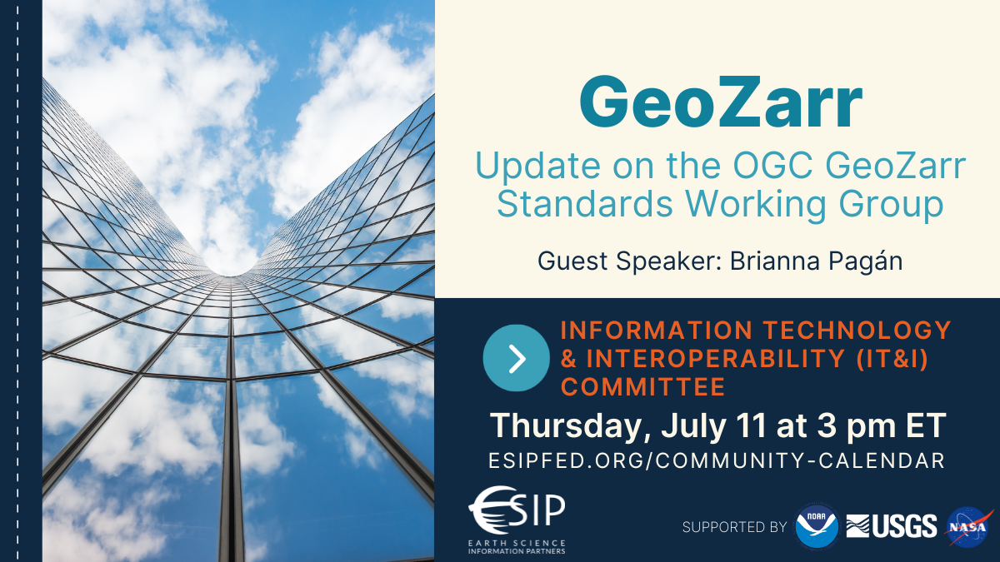
<figcaption>IT&amp;I July 2024</figcaption>
</figure>

**<u>Recording</u>**:

<iframe width="560" height="315" src="https://www.youtube.com/embed/l3o11uLdm7E?si=cOBaSNFpzuYjQU3P" title="YouTube video player" frameborder="0" allow="accelerometer; autoplay; clipboard-write; encrypted-media; gyroscope; picture-in-picture; web-share" referrerpolicy="strict-origin-when-cross-origin" allowfullscreen></iframe>

## June 13th: "Evaluation and recommendation of practices for publication of reproducible data and software releases in the USGS"

[Alicia Rhoades, Dave Blodgett, Ellen Brown, Jesse
Ross.](https://www.usgs.gov/centers/community-for-data-integration-cdi/science/evaluation-and-recommendation-practices#overview)

USGS Fundamental Science Practices recognize data and software as
separate information product types. In practice, (e.g., in model
application) data are rarely complete without workflow code and
workflows are often treated as software that include data. This project
assembled a cross mission area team to build an understanding of current
practices and develop a recommended path. The project conducted 27
interviews with USGS employees with a wide range of staff roles from
across the bureau. The project also analyzed existing data and software
releases to establish an evidence base of current practices for
implemented information products. The project team recommends that a
workshop be held at the next Community for Data Integration face to face
or other venue. The workshop should consider the sum total of the
findings of this project and plan specific actions that the Community
can take or recommendations that the Community can advocate to the
Fundamental Science Practices Advisory Council or others.

<figure>
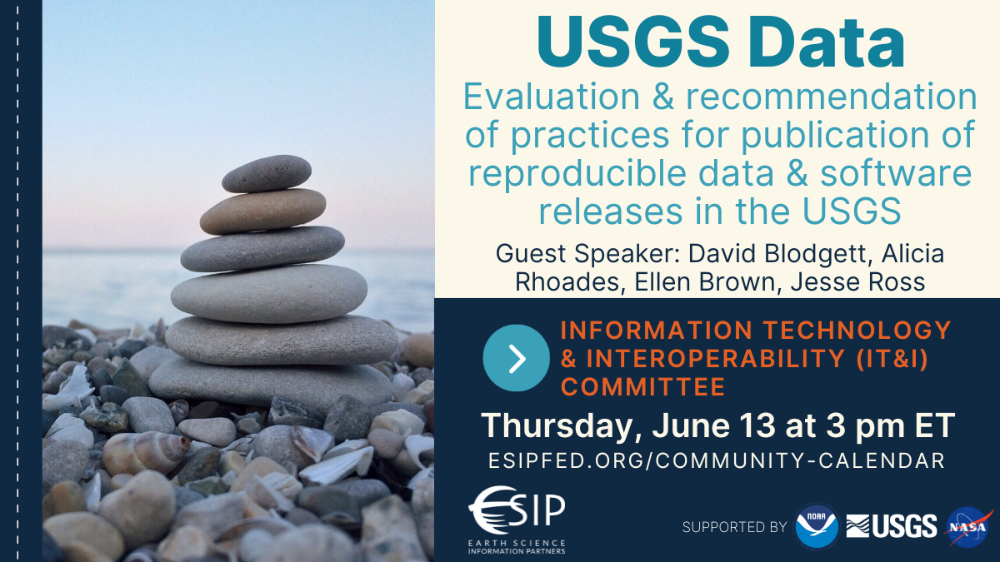
<figcaption>IT&amp;I June 2024</figcaption>
</figure>

**<u>Recording</u>**:

<iframe width="560" height="315" src="https://www.youtube.com/embed/orjBINgaXag?si=a41TWK1vZZsXLyph" title="YouTube video player" frameborder="0" allow="accelerometer; autoplay; clipboard-write; encrypted-media; gyroscope; picture-in-picture; web-share" referrerpolicy="strict-origin-when-cross-origin" allowfullscreen></iframe>

## May 9th: "Achieving FAIR water quality data exchange thanks to international OGC water standards"

[(Sylvain Grellet - BRGM)](https://orcid.org/0000-0001-7656-1830)

Leveraging on international standards (OGC, ISO), the OGC, WMO Water
Quality Interoperabily Experiment aims at bridging the gap regarding
Water Quality data exchange (surface, ground water). This presentation
will also give a feedback on the methodology applied on this journey.
How to build on existing international standards (OGC/ISO 19156
Observations, measurements and samples ; OGC SensorThings API) while
answering domain needs and maximize community effect.

<figure>
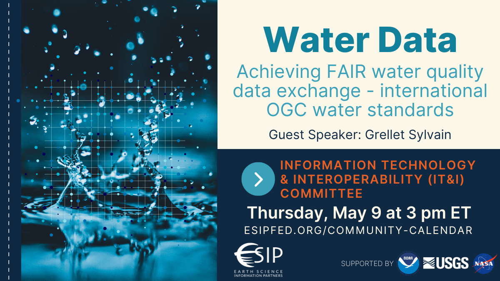
<figcaption>IT&amp;I FAIR water quality data</figcaption>
</figure>

**<u>Recording</u>**:

<iframe width="560" height="315" src="https://www.youtube.com/embed/AlYnSNWJYy0?si=nQfGtfJ51cJM60v8" title="YouTube video player" frameborder="0" allow="accelerometer; autoplay; clipboard-write; encrypted-media; gyroscope; picture-in-picture; web-share" referrerpolicy="strict-origin-when-cross-origin" allowfullscreen></iframe>

**<u>Slides</u>**

<figure>
<embed src="files/FAIR_water_quality_data_OGC_Grellet-compressed.pdf"
title="Slides from May 2024 IT&amp;I" />
<figcaption>Slides from May 2024 IT&amp;I</figcaption>
</figure>

**<u>Minutes:</u>**

- Emphasis on international water data standards.
- Introduced OGC – international standards with contribution from
  public, private, and academic stakeholders.
- Hydrology Domain Working Group around since circa 2007
  - This presentation is about the latest activity, the Water Quality
    Interoperability Experiment
- Relying on a baseline of conceptual and implementation modeling from
  the Hydro Domain Working Group and more general community works like
  Observations Measurements and Samples.
- Considering both in-situ (sample observations) and ex-situ
  (laboratory).
- Core data models support everything the IE has needed with some key
  extensions, but the models are designed to support extensions.
- In terms of FAIR access, Sensorthings is very capable for
  observational data and OGC-API Features support geospatial needs well.
- Introduced a separation between "sensor" and "procedure" – sensor is
  the thing you used, procedure is the thing you do.

## April 11th: "A Home for Earth Science Data Professionals - ESIP Communities of Practice"

[(Allison Mills)](https://www.esipfed.org/about/people/#people_bios-1-4)

Earth Science Information Partners (ESIP) is a nonprofit funded by
cooperative agreements with NASA, NOAA, and USGS. To empower the use and
stewardship of Earth science data, we support twice-annual meetings,
virtual collaborations, microfunding grants, graduate fellowships, and
partnerships with 170+ organizations. Our model is built on an
ever-evolving quilt of collaborative tools: Guest speaker Allison Mills
will share insights on the behind-the-scenes IT structures that support
our communities of practice.

<figure>
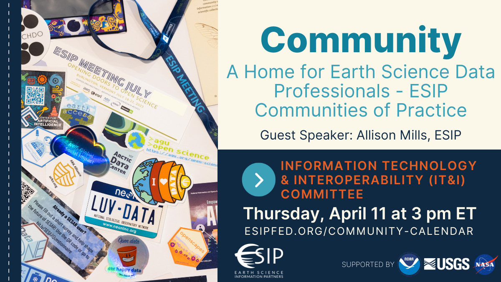
<figcaption>IT&amp;I ESIP Communities of Practice</figcaption>
</figure>

**<u>Recording</u>**:\

<iframe width="560" height="315" src="https://www.youtube.com/embed/6loiBWpgMGE?si=yvIMfhKNbDrX_cn_" title="YouTube video player" frameborder="0" allow="accelerometer; autoplay; clipboard-write; encrypted-media; gyroscope; picture-in-picture; web-share" referrerpolicy="strict-origin-when-cross-origin" allowfullscreen></iframe>

**<u>Minutes:</u>**

- Going to to talk about the IT infrastructure behind the ESIP cyber
  presence.
- Shared ESIP Vision and Mission – BIG goals!!
- Played a video about what ESIP is as a community.
- But how do we actually "build a community"?
- Virtual collaborations need digital tools.
- https://esipfed.org/collaborate
  - Needs a front door and a welcome mat!
  - "It doesn't matter how nice your doormat is if your porch is
    rotten."
  - Tools: Homepage, Slack, Update email, and people Directory.
  - "We take easy collaboration for granted."
- https://esipfed.org/lab
  - Microfunding – build in time for learning objectives.
  - RFP system, github, figshare, people directory.
  - "Learning objectives are a key component of an ESIP lab project."
- https://esipfed.org/meetings
  - Web site, agendas, eventbrite, QigoChat + Zoom, Google Docs.

Problem: our emails bounce! Needed to get in the weeds of DNS and
"DMARC" policies.

Domain-based Message Authentication, Reporting, and Conformance (DMARC)

Problem: Twitter is now X

Decided to focus on platforms where engagement is higher.

Problem: Old wikimedia pages are way way outdated.

Focus on creating new web pages that replace, update and maintain
community content.

Problem: "I can't use platform XYZ"

Try to go the extra mile to adapt so that these issues are overcome.

## March 15th: "Creating operational decision ready data with remote sensing and machine learning."

[(Brian Goldin](https://www.voyagersearch.com/))

<figure>
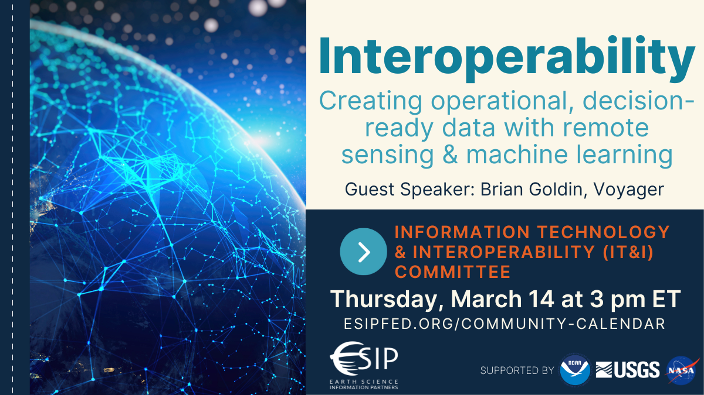
<figcaption>IT&amp;I Operational Remote Sensing 2024</figcaption>
</figure>

As organizations grapple with information overload, timely and reliable
insights remain elusive, particularly in disaster scenarios. Voyager's
participation in the OGC Disaster Pilot 2023 aimed to address these
challenges by streamlining data integration and discovery processes.
Leveraging innovative data conditioning and enrichment techniques,
alongside machine learning models, Voyager transformed raw data into
actionable intelligence. Through operational pipelines, we linked
diverse datasets with machine learning models, automating the generation
of new observations to provide decision-makers with timely insights
during critical moments. This presentation will explore Voyager's role
in enhancing disaster response capabilities, showcasing how innovative
integration of technology along with open standards can improve
decision-making processes on a global scale.

**<u>Recording</u>**:\

<iframe width="560" height="315" src="https://www.youtube.com/embed/TFGLnVljAlY?si=LzpWoMWZx_3YMk0H" title="YouTube video player" frameborder="0" allow="accelerometer; autoplay; clipboard-write; encrypted-media; gyroscope; picture-in-picture; web-share" referrerpolicy="strict-origin-when-cross-origin" allowfullscreen></iframe>

**<u>Minutes:</u>**

Providing insights from the OGC Disaster Pilot 2023

Goal with work is to provide timely and reliable insights based on huge
volumes of data.

"Overcome information overload in critical moments"

Example: 2022 Callao Oil Spill in Peru

Tsunami hit an oil tanker transferring oil to land.

Possibly useful data from many remote sensing products but hard to
combine them all together in the moment of responding to an oil spill.
(slide shows dozens of data sources)

Goal: build a centralized and actionable inventory of data resources.

1.  Connect and read data,
2.  build pipelines to enrich data sources,
3.  populate a registry of data sources,
4.  construct processing framework that can operate over the registry,
5.  build user experience framework that can execute the framework.  

Focus is on an adaptable processing framework for model execution.

At this scale and for this purpose, it's critical to have a receipt of
what was completed with basic results in a registry that is searchable.
Allows model results to trigger notifications or be searched based on a
record of model runs that have been run previously.

For the pilot: focused on wildfire, drought, oil spill, and climate.

"What indicators do decision makers need to make the best decisions?"

What remote sensing processing models can be run in operations to
provide these indicators?

Fire Damage Assessment

Detected building footprints using a remote sensing building detection
model.

Can run fire detection model in real time cross referenced with building
footprints.

Need for stronger / more consistent "model metadata"

Need data governance/fitness for use metadata

Need better standards that provide linkages between systems.

Need better public private partnerships.

Need better data licensing and sharing framework.

"This is not rocket science, it's really just building a good metadata
registry."

## February 15th: "Creating Great Data Products in the Cloud"

[(Jed Sundwall](https://radiant.earth/about/))

<figure>
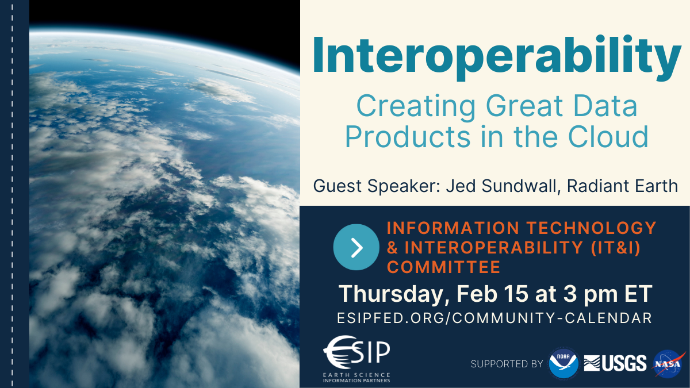
<figcaption>IT&amp;I Cloud Data Products 2024</figcaption>
</figure>

Competition within the public cloud sector has reliably led to reduction
in object storage costs, continual improvement in performance, and a
commodification of services that have made cloud-based object storage a
viable solution to share almost any volume of data. Assuming that this
is true, what are the best ways to create data products in a cloud
environment? This presentation will include an overview of lessons
learned from Radiant Earth as they’ve advocated for adoption of
cloud-native geospatial data formats and best practices.

**<u>Recording</u>**:\

<iframe width="560" height="315" src="https://www.youtube.com/embed/4cWGJcOcAEA?si=NYWSSB7DiGK2nrMN" title="YouTube video player" frameborder="0" allow="accelerometer; autoplay; clipboard-write; encrypted-media; gyroscope; picture-in-picture; web-share" allowfullscreen></iframe>

**<u>Minutes:</u>**

Jed is executive director of Radiant Earth – Focus is on human
cooperation on a global scale.

Two major initiatives – Cloud Native Geospatial foundation and Source
Cooperative

Cloud native geospatial is about adoption of efficient approaches Source
is about providing easy and accessible infrastructure

What does "Cloud Native" mean? <https://guide.cloudnativegeo.org/>
partial reads, parallel reads, easy access to metadata

Leveraging market pressure to make object stores cheaper and more
scalable.

"Pace Layering" –
<https://jods.mitpress.mit.edu/pub/issue3-brand/release/2>

Observation: Software is getting cheaper and cheaper to build – it gets
harder to create software monopolies in the way Microsoft or ESRI have.

This leads to a lot of diversity and a proliferation of "primitive"
standards and defacto interoperability arrangements.

**Source Cooperative**

Borrowed a lot from github architecturally.

Repository with a README

Browser of contents in the browser.

Within this, what makes a great data product?

"Our data model is the Web"

People will deal with messy data if it's super valuable.

Case in point, IRS 990 data on non-profits was shared in a TON of xml
schemas. People came together to organize it and work with it.

Story about a building footprint data released in the morning – had been
matched up into at least four products by the end of the day.

Shout out to: <https://www.geoffmulgan.com/> and
<https://jscaseddon.co/>

<https://jscaseddon.co/2024/02/science-for-steering-vs-for-decision-making/>

"We don't have institutions that are tasked with producing great data
products and making them available to the world!"

<https://radiant.earth/blog/2023/05/we-dont-talk-about-open-data/>
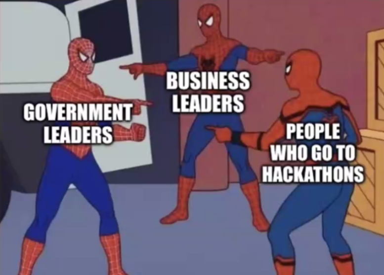

"There's a server somewhere where there's some stuff" – This is very
different from a local hard drive where everything is indexed.

A cloud native approach puts the index (metadata) up front in a way that
you can figure out what you need.

A file's metadata gives you the information you need to ask for just the
part of a file that you actually need.

But there are other files where you don't need to do range requests.
Instead, the file is broken up into many many objects that are indexed.

In both cases, the metadata is a map to the content. Figuring out the
right size of the content's bits is kind of an art form.

<https://www.goodreads.com/en/book/show/172366>

Q: \> I was thinking of your example of Warren Buffett's daily
spreadsheet (gedanken experiment)... How do you see data quality or data
importance (incl. data provider trustworthiness) being effectively
conveyed to users?

A: We want to focus on verification of who people are and relying on
reputational considerations to establish importance.

Q: \> I agree with you about the importance of social factors in how
people make decisions. What do you think the implications are of this
for metadata for open data on the cloud?

A: Tracking data's impact and use is an important thing to keep track
of. Using metadata as concrete records of observations and how it has
been used is where this becomes important.

Q: \> What about the really important kernels of information that we use
to, say calibrate remote sensing products, that are really small but
super important? How do we make sure those don't get drowned? A: We need
to be careful not to overemphasize "everything is open" if we can't keep
really important datasets in the spotlight.

## January 11th: "Using Earth Observations for Sustainable Development"

"Using Earth Observation Technologies when Assessing Environmental,
Social, Policy and Technical factors to Support Sustainable Development
in Developing Countries"

[Sharif Islam](https://www.media.mit.edu/people/shariful/overview/)

Earth Observation (EO) technologies, such as satellites and remote
sensing, provide a comprehensive view of the Earth's surface, enabling
real-time monitoring and data acquisition. Within the environmental
domain, EO facilitates tracking land use changes, deforestation, and
biodiversity,   thereby   supporting   evidence-based   conservation  
efforts.   Social   factors, encompassing population dynamics and
urbanization trends, can be analyzed to inform inclusive and resilient
development strategies. EO also assumes a crucial role in policy
formulation by furnishing accurate and up-to-date information on
environmental conditions, thereby supporting informed decision-making.
Furthermore, technical aspects, like infrastructure development and
resource management, benefit from EO's ability to provide detailed
insights into terrain characteristics and natural resource distribution.
The integration of Earth Observation across these domains yields a
comprehensive understanding of the intricate interplay between
environmental, social, policy, and technical factors, fostering a more
sustainable and informed approach to development initiatives. In this
presentation, I will discuss our lab's work in Bangladesh, Angola, and
other countries, covering topics such as coastal erosion, drought, and
air pollution.

**<u>Recording</u>**:\

<iframe width="560" height="315" src="https://www.youtube.com/embed/PhEg9bTd1JU?si=EUfOaz3nzEFdOOsb" title="YouTube video player" frameborder="0" allow="accelerometer; autoplay; clipboard-write; encrypted-media; gyroscope; picture-in-picture; web-share" allowfullscreen></iframe>

**<u>Minutes:</u>**

Plan to share data from NASA and USGS that was used in his PHD work.

Applied the EVDT Environment, Vulnerability, Decision Technology
Framework.

Studied a variety of hazards – coastal erosion, air pollution, drought,
deforestation, etc.

**Coastal Erosion in Bangladesh:**

- Displacement, loss of land, major economic drain
- Studied the situation in the Bay of Bengal
- Used LANDSAT to study coastal erosion from the 80s to the present
- Coastal erosion rates upwards of 300m/yr!
- Combined survey data and landsat observations

**Air Pollution and mortality in South Asia**

- Able to show change in air pollution over time using remote sensing

**Drought in Angola and Brazil**

Used SMAP (Soil Moisture Active Passive)

Developed the same index as the US Drought Monitor

Able to apply SMAP observations over time

Applied a social vulnerability model using these data to identify
vulnerable populations.

**Deforestation in Ghana**

Used LANDSAT to identify land converted from forest to mining and urban.

Significant amounts of land to mining (gold mining and others)

**Water hyacinth in a major fishery lake in Benin.**

Impact on fishery and transportation

Rotting hyacinth is a big issue

Helped develop a DSS to guide management practices

**Mangrove loss in Brazil**

Combined information from economic impacts, urban plans, and remote
sensing to help build a decision support tool.

## November 9th: "Persistent Unique Well Identifiers: Why does California need well IDs?"

<figure>
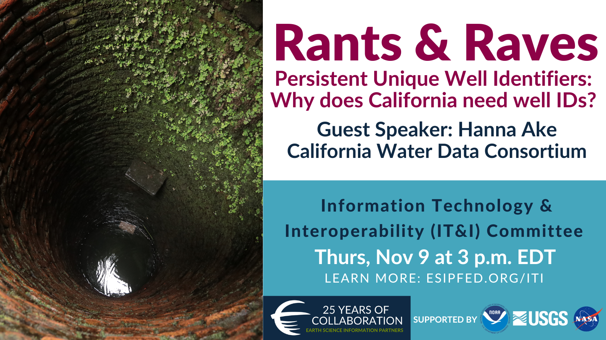
<figcaption>IT&amp;I CA Wells November 2023</figcaption>
</figure>

[Hannah Ake](https://cawaterdata.org/teams/hannah-ake/)

Groundwater is a critical resource for farms, urban and rural
communities, and ecosystems in California, supplying approximately 40
percent of California's total water supply in average water years, and
in some regions of the state, up to 60 percent in dry years. Regardless
of water year type – some communities rely entirely on groundwater for
drinking water supplies year-round. However, California lacks a uniform
well identification system, which has real impacts on those who manage
and depend upon groundwater. Clearly identifying wells, both existing
and newly constructed, is vital to maintaining a statewide well
inventory that can be more easily monitored to ensure the wellbeing of
people, the environment, and the economy, while supporting the
sustainable use of groundwater. A uniform well ID program has not yet
been accomplished at a scale like California, but it is achievable, as
evidenced by great successes in other states. Learn more about why a
well ID program will be so important to tackle in California and offer
your thoughts about how to untangle some of the particularly thorny
technical challenges.

**<u>Recording</u>**:\

<iframe width="560" height="315" src="https://www.youtube.com/embed/dvxOHh86QVQ?si=GtgSG62nbj2aVMR0" title="YouTube video player" frameborder="0" allow="accelerometer; autoplay; clipboard-write; encrypted-media; gyroscope; picture-in-picture; web-share" allowfullscreen></iframe>

**<u>Minutes:</u>**

- Groundwater is 40-60% of California's Water supply
- ~2 Million groundwater wells!
- As many as 15k new wells are constructed each year

Sustainable groundwater management act frames groundwater sustainability
agencies that develop groundwater sustainability plans

There is a need to account for groundwater use to ensure the plans are
achieved.

Problem: There is no dedicated funding (or central coordinator) to
create and maintain a statewide well inventory.

…

- Department of Water Resources develops standards
- State Water Resources Control Board has statewide ordinance
- Cities and local districts adopt local ordinance
- Local enforcement agency administers and enforces ordinance

There are a lot of IDs in use. 5 different identifiers can be used for
the same well.

Solution: Create a well inventory that is statewide but is a compound
(single id that stands in for many others) id from multiple id systems.
– A meaningless identifier that links multiple others to each other.

There are a number of states with well id programs.

- Trying to learn from what other states have done.

Going forward with some kind of identifier system that spans all local
and federal identifier systems.

- Q: Will this include federal wells? – Yes!
- Q: Will this actually be a new well identifier minted by someone? –
  Yes.
- Q: If someone drills a well do they have to register it? – Yes, but
  it's the local enforcing agency that collects the information.
- Q: What if a well is deepened? Do we update the ID? – This has caused
  real problems in the past. We end up with multiple IDs for the same
  hole that go through time.
  - Seems to make sense to make a new one to keep things simple.

Link mentioned early in the talk:

<https://groundwateraccounting.org/>

Reference during Q&A

<https://docs.ogc.org/per/20-067.html#_cerdi_vvg_selfie_demonstration>

## October 26th: "Improving standards and documentation publishing methods: Why can’t we cross the finish line?"

<figure>
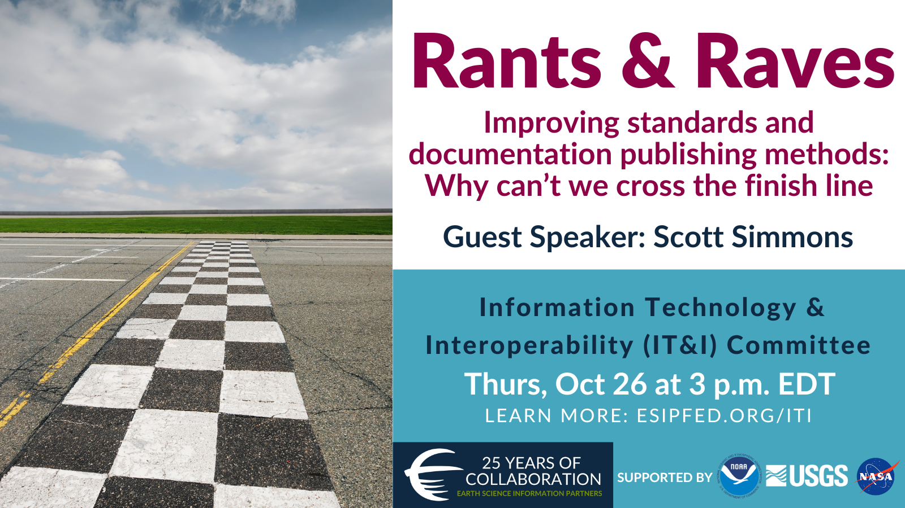
<figcaption>IT&amp;I OGC October 2023</figcaption>
</figure>

[Scott Simmons](https://www.ogc.org/about/team/scott-simmons/)

OGC and the rest of the Standards community have been promising for
YEARS that our Standards and supporting documentation will be more
friendly to the users that need this material the most. Progress has
been made on many fronts, but why are we still not finished with a
promise made in 2015 that all OGC Standards will be available in
implementer-friendly views first, ugly virtual printed paper second?This
topic bugs me as much as it bugs our whole community. Some of the
problems are institutional (often from our Government members across the
globe), others are due to lack of resources, but I think that most are
due to a lack of clear reward to motivate people to do things
differently.Major progress is being made in some areas. The OGC APIs
have landing pages that include focused and relevant content for
users/implementers and it takes some effort to find the owning Standard.
OGC Developer Resources are growing quickly with sample code, running
examples, and multiple views of API resources in OpenAPI, Swagger, and
ReDoc.

[Slides](https://gcc02.safelinks.protection.outlook.com/?url=https%3A%2F%2Fportal.ogc.org%2Ffiles%2F%3Fartifact_id%3D106445&data=05%7C01%7Cdblodgett%40usgs.gov%7Cfb8c43b89a0e45fbb4ff08dbd56a8577%7C0693b5ba4b184d7b9341f32f400a5494%7C0%7C0%7C638338425710712359%7CUnknown%7CTWFpbGZsb3d8eyJWIjoiMC4wLjAwMDAiLCJQIjoiV2luMzIiLCJBTiI6Ik1haWwiLCJXVCI6Mn0%3D%7C3000%7C%7C%7C&sdata=Z1GilUJ3gQaBmwi7QPaz3%2Fa2ycaqRcsJlNfoYN4aG0U%3D&reserved=0)

**<u>Recording</u>**:\

<iframe width="560" height="315" src="https://www.youtube.com/embed/HJ7TbhcVs-U?si=hcUmpoIaTz4zNodo" title="YouTube video player" frameborder="0" allow="accelerometer; autoplay; clipboard-write; encrypted-media; gyroscope; picture-in-picture; web-share" allowfullscreen></iframe>

**<u>Minutes:</u>**

(missing first ~15 minutes of recording -- apologies)

Circa 2015 OGC GeoRabble

- Took a critical look at the status of publishing standards.
- Couldn't we format these specs in a kind of tutorial form?

<!-- -->

- Lots of snippets and tutorial content in the specs.
  - E.g. <http://opengeospatial.github.io/e-learning/index.html>
- Multiple representations of specifications – that OGC staff could
  maintain

9 years later

- What makes this hard?
  - Standards must be unambiguous AND procurable.
  - The modular specification is a model for this balance.

Standards are based around testable requirements that relate to
conformance classes.

Swaggerhub and ReDoc as a way to show a richer collection of information
for multiple users.

Specification are much more modular (core and extensions)

Developer website: <https://developer.ogc.org/>

Going to be including persistent  demonstrator (example implementations)
that are "in the wild".

<https://www.ogc.org/initiatives/open-science/>

Moving to an "OGC Building Blocks" model that are registered across
multiple platforms and linked to lots of examples.

Building blocks are richly described and nuanced but linked back to
specific requirements in a specification.

<https://blocks.ogc.org/>

<https://sn80uo0zmbg.typeform.com/to/gcwDDNB6?typeform-source=blocks.ogc.org>

A lot of this focused on APIs – what about data models?

- Worked on APIs first because it was current. Also thinking about how
  to apply similar concepts to data models.

## September 14th: "Water data standardization: Navigating the AntiCommons"

<figure>
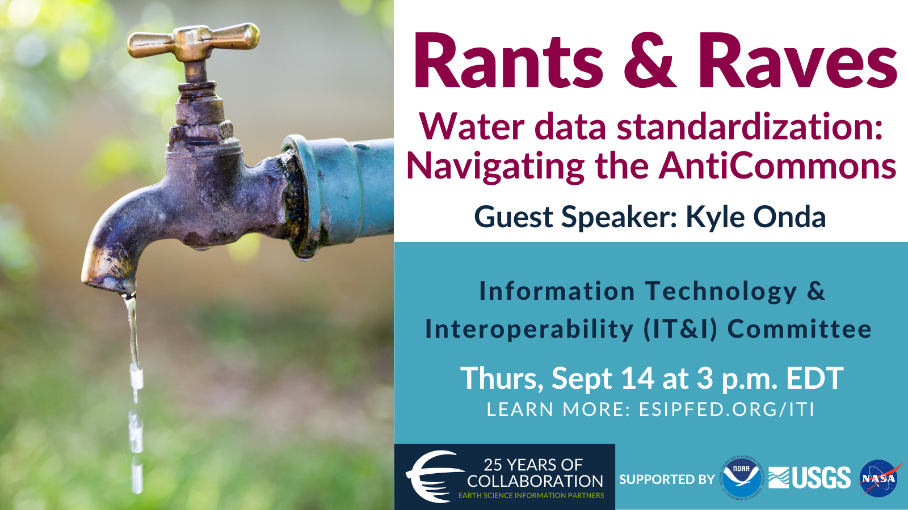
<figcaption>IT&amp;I IoW September 2023</figcaption>
</figure>

[Kyle Onda](https://internetofwater.org/about/people/kyle-onda/)

We all know interoperability rests on data standards and API standards.
Many open standards are less prominent in the open water data space than
proprietary solutions. This is because proprietary data management
solutions are often bundled with very easy to use implementing software
and more importantly—client software that address basic use cases. We’re
giving people blueprints when they need houses. Community standards
making processes should invest in end-user tools if they want to gain
traction. The good news is that some of the newest generation of
standards is much easier to develop around which has led to some
reference implementations that are much easier to create end-user tools
around than previously.

**<u>Recording</u>**:\

<iframe width="560" height="315" src="https://www.youtube.com/embed/miFwXB-E1V8?si=Xr2SF_okCxLv2lL2" title="YouTube video player" frameborder="0" allow="accelerometer; autoplay; clipboard-write; encrypted-media; gyroscope; picture-in-picture; web-share" allowfullscreen></iframe>

**<u>Minutes:</u>**

AntiCommons – name comes from social science background

Tragedy of the commons - two solutions, enclose (privatize) or regulate

Tragedy of the anticommons - as opposed to common resources, these are
resources that don't get used up – as in open data. Inefficiency and
under utilization is common.

`   Two solutions. expropriation (like imminent domain or public data), incentivize `

Example – consolidate urban sprawl into higher density housing to get
more open space and room for business.

Introducing the Internet of Water.

Noting that in PNW, there are \>800 USGS stream gages and \>400 from
other organizations. Only USGS are very broadly known about.

Thinking about open data as an anticommons – environmental data is
normally publically available but only in ways that are convenient to
data providers and the software that they use.

Discussion of the variety of standardized vs bespoke modes of data
dissemination.

Example of Nebraska – GUI with download and separate custom API USGS has
the same basic scheme where an ETL goes from data management software to
a custom web service system.

What's going on here? Limited resources lead to focus on existing users
and needs and administration ease.

Tools that meet this need tend to not focus on the needs of new user and
standardization.

Most organizations don't need standards – they need software. Both
server and CLIENT software.

New specs and efforts ARE heading in this direction.

`   OGC-API, SensorThings, etc.`

Promising developments around proxying non standard APIs and in use of
structured data "decoration" to make documentation more standard.

## August 10th: "Learning to love the upside down: Quarto and the two data science worlds"

<figure>
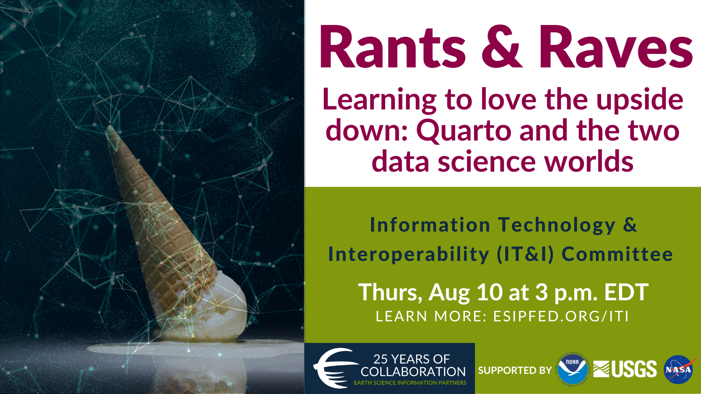
<figcaption>IT&amp;I Quarto August 10th</figcaption>
</figure>

[Carlos Scheidegger](https://cscheid.net/v2/)

There are two wonderful data science worlds. You can be a jupyter
expert: you work on jupyter notebooks, with access to myriad Julia,
Python, and R packages, and excellent technical documentation systems.
You can also be a knitr and rmarkdown expert: you work on rmarkdown
notebooks, with access to myriad Julia, Python, and R packages, and
excellent technical documentation systems.

But what if your colleague works on the wrong side of the fence? What if
you spent years learning one of them, only to find that the job you love
is in an organization that uses the other? In this talk, I’m going to
tell you about quarto, a system for technical communication (software
documentation, academic papers, websites, etc) that aspires to let you
choose any of these worlds.

If you’re one to worry about Conway’s law and what this two-worlds
situation does to an organization’s talent pool, or if you live in one
side of the world and want to be able to collaborate with folks on the
other side, I think you’ll find something of value in what I have to
say.

I’m also going to complain about software, mostly the one I write.
Mostly.

Slides: <https://cscheid.net/static/2023-esip-quarto-talk/>

**<u>Recording</u>**:\

<iframe width="560" height="315" src="https://www.youtube.com/embed/uQ3yZjM1bj8" title="YouTube video player" frameborder="0" allow="accelerometer; autoplay; clipboard-write; encrypted-media; gyroscope; picture-in-picture; web-share" allowfullscreen></iframe>

**<u>Minutes:</u>**

Carlos was in a tenure computer science position at University of
Arizona.

Hating bad software makes a software developer a good developer.

Two data science worlds:

tidyverse (with R and markdown)

- Cohesive, hard to run things out of order.
- Doesn't store output.

Jupyter (python and notebooks)

- Notebook saves intermediate outputs.
- State can be messed up easily – cells aren't linear steps.

Quarto:

- Acts as a compatibility layer for tidyverse and jupyter ecosystems.
- Emulates RMarkdown with multi language support.

Rant:

Quarto gets you a webpage and PDF output.

– note that the PDF requirement is not great.

Quarto is kind of just a huge wrapper around pandoc.

Quarto documentation is intractably hard to build out.

Consider Conways Law – that an organization that creates a large system
will create a system that is a copy of the organization's communication
structure.

– Quarto is meant to allow whole organizations with different technical
tools exist in the same communication structure (same system).

Quarto tries to make kinda hard things easy while not making really hard
things impossible.

Quarto can convert jupyter notebooks (with cached outputs) into markdown
and vice versa.

Issue is, you need to know a variety of other languages (YAML, CSS,
Javascript, LaTeX, etc.)

– "unavoidable but kinda gross"

You can edit Quarto in RStudio or VS Code, or any text editor.

For collaboration, Quarto projects can use jupyter or knitr engines.
E.g. in a single web page, you can build one page with jupyter and
another page with knitr.

– you can embed a ipynb cell in a notebook.

Orchestrating computation is hard – quarto has to take input from
existing computation – which can be awkward / complex.

Quarto is extensible – CSS themes, OJS for interactive webpages, Pandoc
extensions.

Can also write your own shortcodes.

## July 13th 2023: "Tools to Assist Simulation Based Researchers in Deciding What Project Outputs to Preserve and Share"

<figure>
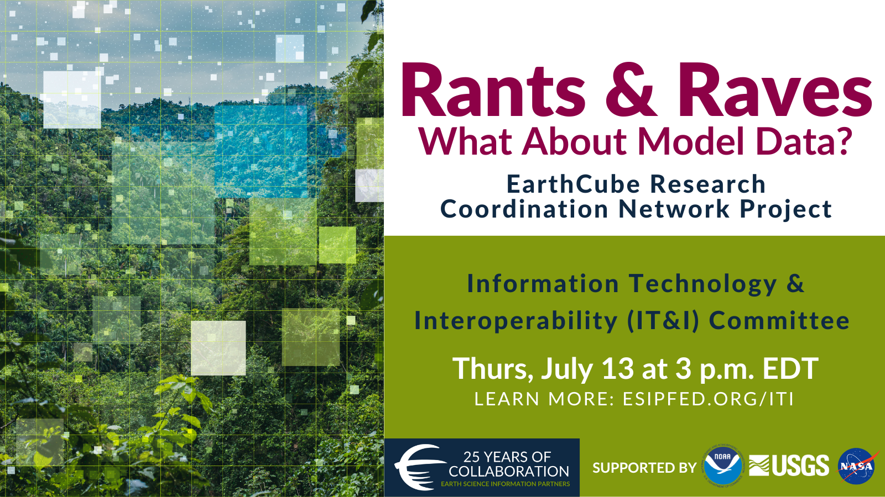
<figcaption>IT&amp;I EarthCube Model RCN July 13th</figcaption>
</figure>

[Doug Schuster](https://staff.ucar.edu/users/schuster)

This presentation will highlight findings from the NSF EarthCube
Research Coordination Network project titled “What About Model Data? -
Best Practices for Preservation and Replicability”
(https://modeldatarcn.github.io/), which suggest that most simulation
based research projects only need to preserve and share selected model
outputs, along with the full simulation experiment workflow to
communicate knowledge. Challenges related to meeting community open
science expectations will also be highlighted.

Slides available here:
[ModelDataRCN-2023-07-13-ESIP-IT&I_v2.pdf](files/ModelDataRCN-2023-07-13-ESIP-IT&I_v2.pdf)

<https://modeldatarcn.github.io/>

Rubric:
<https://modeldatarcn.github.io/rubrics-worksheets/Descriptor-classifications-worksheet-v2.0.pdf>

*Open science expectations for simulation based research. Frontiers in
Climate, 2021. <https://doi.org/10.3389/fclim.2021.763420>*

**<u>Recording</u>**:\

<iframe width="560" height="315" src="https://www.youtube.com/embed/ulk0mQSQNzQ" title="YouTube video player" frameborder="0" allow="accelerometer; autoplay; clipboard-write; encrypted-media; gyroscope; picture-in-picture; web-share" allowfullscreen></iframe>

**<u>Minutes:</u>**

Primary motivation: What are data management requirements for simulation
projects?

Project ran May 2020 to Jul 2022

We clearly shouldn't preserve ALL data / output from projects. It's just
too expensive.

Project broke down components of data associated with a different
project Forcings, code/documentation, selected outputs.

But what outputs to share?!?

Project developed a rubric of what to preserve / share.

"Is your project a data production project or a knowledge production
project"

"How hard is it to rerun your workflow?"

"How much will it cost to store and serve the data?"

Rubric gives guidance on how much of a project's outputs should be
preserved.

So this is all well and good, but it falls onto PIs and funding
agencies.

What are the ethical and professional considerations of these trade
offs?

What are the incentives in place currently? Sharing is not necessarily
seen as a benefit to the author.

## June 8 2023: "Reproducible Data Pipelines in Modern Data Science: what they are, how to use them, and examples you can use!"

<figure>
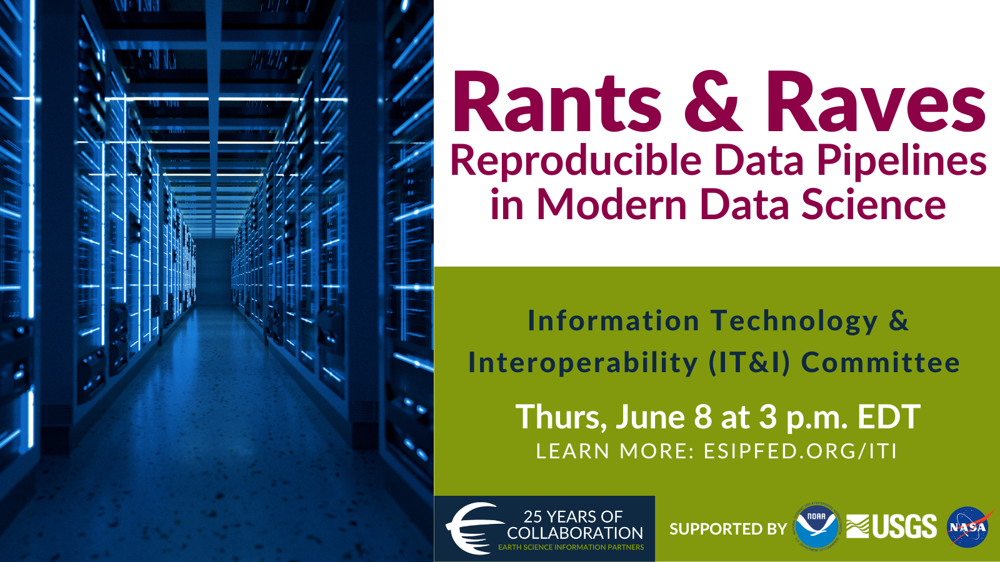
<figcaption>IT&amp;I Reproducible Pipelines June 8th</figcaption>
</figure>

[Julie Padilla](https://www.usgs.gov/staff-profiles/julie-padilla)

Modern scientific workflows face common challenges including
accommodating growing volumes and complexity of data and the need to
update analyses as new data becomes available or project needs change.
The use of better practices around reproducible workflows and the use of
automated data analysis pipelines can help overcome these challenges and
more efficiently translate open data to actionable scientific insights.
These data pipelines are transparent, reproducible, and robust to
changes in the data or analysis, and therefore promote efficient, open
science. In this presentation, participants will learn what makes a
reproducible data pipeline and what differentiates it from a workflow as
well as the key organizational concepts for effective pipeline
development.

**<u>Recording</u>**:\

<iframe width="560" height="315" src="https://www.youtube.com/embed/K8EOY_HLlho" title="YouTube video player" frameborder="0" allow="accelerometer; autoplay; clipboard-write; encrypted-media; gyroscope; picture-in-picture; web-share" allowfullscreen></iframe>

**<u>Minutes:</u>**

Motivation – what if we find bad data in an input, what if we need to
rerun something with new data, can we reproduce findings from previous
work?

Need to be able to "trace" what we did and the way we do it needs to be
reliable.

A "workflow" is a sequence of steps going from start to finish of some
activity or process.

A "pipeline" is a programmatic implementation of a workflow that
requires little to no interaction.

In a pipeline, if one workflow step or input gets changed, we can track
what is "downstream" of it.

Note that different steps of the workflow may be influenced by different
people. So a given step of a pipeline could be contributed by different
programmers. But each person would be contributing a component of a
consistent pipeline.

There is a difference between writing scripts to building a reproducible
pipeline.

`   Better to break it into steps. Script -> organize -> encapsulate into functions -> assemble pipeline.`

Focus is on R targets – snakemake is equivalent in python.

Key concepts for going from script to workflow: Functions stored
separate from workflow script. Steps clearly organized in script. Can
wrap steps in pipeline steps to track them.

Pipeline software keeps track of whether things have changed and what
needs to be rerun.

`   Allows visualization of the workflow inputs, functions, and steps.`

How do steps of the pipeline get related to eachother?

`   They are named and the target names get passed to downstream targets.`

Chat questions about branching.

`   Dynamic branching lets you run the same target for a list of inputs in a map/reduce pattern. `

Pipelines can have outputs that are reports that render pipeline results
in a nice form.

Pipeline templates:

`   A pipeline can adopt from a standard template that is pre-determined. `\
`   Helps enforce best practices and have a quick and easy starting point.`

Note that USGS data science has a template for a common pattern.

What's a best practice for tracking container function and
reproducibility?

`   Versioned Git / Docker for code and environment.`\
`   For data, it is context dependent. Generally, try to pull down citeable / persistent sources. If sources are not persistent, you can cache inputs for later reuse / reproducibility.`\
`   `

Data change detection / cacheing is a really tricky thing but many
people are working on the problem.
<https://cboettig.github.io/contentid/>, <https://dvc.org/>

<https://learning.nceas.ucsb.edu/2021-11-delta/session-3-programmatic-metadata-and-data-access.html#reproducible-data-access>

## 11 May 2023: "Software Procurement Has Failed Us Completely, But No More!"

<figure>
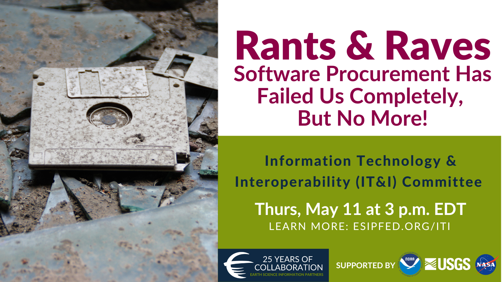
<figcaption>IT&amp;I Software Procurement May 11th</figcaption>
</figure>

[Waldo Jaquith](https://waldo.jaquith.org/)

The way we buy custom software is terrible for everybody involved, and
has become a major obstacle to agencies achieving their missions. There
are solutions, if we would just use them! By combining the standard
practices of user research, Agile software development, open source,
modular procurement, and time & materials contracts, we can make
procurement once again serve the needs of government.

Slides available here: [2023-05-Jaquith.pdf](files/2023-05-Jaquith.pdf)

**<u>Recording</u>**:\

<iframe width="560" height="315" src="https://www.youtube.com/embed/V4-3WZ5hN5k" title="YouTube video player" frameborder="0" allow="accelerometer; autoplay; clipboard-write; encrypted-media; gyroscope; picture-in-picture; web-share" allowfullscreen></iframe>

**<u>Minutes:</u>**

Recognizing that software procurement is one of the primary ways that
Software / IT systems advance, Waldo went into trying to understand that
space as a software developer.

**Healthcare.gov**

Contract given to CGI Federal for \$93M – cost ~1.7B by launch.\
Low single digits numbers of people actually made it through the
system.\
Senior leaders were given the impression that things were in good
shape.\
The developers working on the site knew it wasn't going to work out (per
IG report).\
\*strategic misrepresentation – things are represented as more rosy as
you go up the chain of command\
On launch, things went very badly and the recovery was actually quite
quick and positive.\
Waldo recommends reading the IG report on healthcare.gov. This article:\
*("The OIG Report Analyzing Healthcare.gov's Launch: What's There And
What's Not", Health Affairs Blog, February 24, 2016.
<https://dx.doi.org/10.1377/hblog20160224.053370>)* provides a path to
the IG report:\
*(HealthCare.gov - CMS Management of the Federal Marketplace: An OIG
Case Study (OEI-06-14-00350),
<https://oig.hhs.gov/oei/reports/oei-06-14-00350.pdf>)* and additional
perspective.

**Rhode Island Unified Health Infrastructure**

(\$364M to DeLoitte) "Big Bang" deployment – they let people running old
systems go on the day of the new system launch. They "outsourced" a
mission critical function to a contractor.

We don't tend to hear about relatively smaller projects because they are
less likely to fail and garner less attention.

Outsourcing as started in the ~90s was one thing when the outsourcing
was for internal agency software. It's different when the systems are
actually public interfaces to stakeholders or are otherwise mission
critical.

**[See slides with big numbers and study sources!!](files/2023-05-Jaquith.pdf)**

It's common for software to meet contract requirements but NOT meet end
user needs.

Requirements complexity is fractal. There is no complete / comprehensive
set of requirements.

… federal contractors interpreting requirements as children trying to
resist getting out the door ...

There is little to no potential to update or improve requirements due to
contract structure.

**Demos not memos!**

Memorable statements:

- Outsourced ability to accomplish agency’s mission
- Load bearing software systems on which the agency depends to complete
  their mission.
- Mission of many agencies is mediated by technology.

But no more! – approach developed by 18F

System of six parts –

1\. User-centered design\
2. Agile software development\
3. Product ownership\
4. DevOps\
5. Building out of loosely coupled parts\
6. Modular contracting\

"You don't know what people need till you talk to them."

Basic premise of agile is good. Focus is on finished software being
developed every two weeks.

Constantly delivering a usable product... e.g. A skateboard is more
usable than a car part.

Key roles for government staff around operations are too often
overlooked.

Product team needs to include an Agency Product Owner. Allows government
representation in software development iteration.

Build out of loosely coupled / interchangeable components. Allows you to
do smaller things and form big coherent systems that can evolve.

Modular contracts allow big projects that are delivered through many
small task orders or contracts. The contract document is kind of a fill
in the blank template and doesn't have to be hard.

Westrum typology of cultures article is relevant is relevant:
<http://dx.doi.org/10.1136/qshc.2003.009522>

## 13 April 2023: "Evolution of open source geospatial python."

<figure>
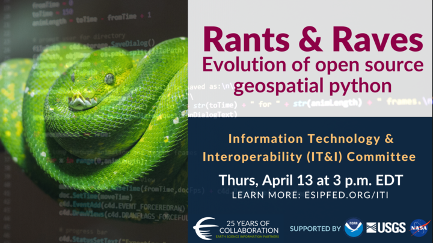
<figcaption>IT&amp;I Python Open Source April 13th</figcaption>
</figure>

[Tom Kralidis](https://github.com/tomkralidis)

Free and Open Source Software in the Geospatial ecosystems (i.e. FOSS4G)
play a key role in geospatial systems and services. Python has become
the lingua franca for scientific and geospatial software and tooling.
This rant and rave will provide an overview of the evolution of FOSS4G
and Python, focusing on popular projects in support of Open Standards.

Slides: <https://geopython.github.io/presentation>

**<u>Recording</u>**:\

<iframe width="560" height="315" src="https://www.youtube.com/embed/HTouLSzKGto" title="YouTube video player" frameborder="0" allow="accelerometer; autoplay; clipboard-write; encrypted-media; gyroscope; picture-in-picture; web-share" allowfullscreen></iframe>

**<u>Minutes:</u>**

Mapserver has been around for 23 years!

Why Python for Geospatial?

`   Ubiquity`\
`   Cross OS compatible`\
`   Legible and easy to understand what it's doing`\
`   Support ecosystem is strong (PyPI, etc.)`\
`   Balance of performance and ease of implementation`

Python: fast enough, and fast in human time -- more intensive workloads
can glue to C/C++

The new generation of OGC services – based on JSON, so the API
interoperates with client environments / objects at a much more direct
level.

The geopython ecosystem has a number of low level components that are
used across multiple projects.

pygeoapi is an OGC API reference implementation and an OSGeo project.
E.g. <https://github.com/developmentseed/geojson-pydantic>

pygeoapi implements OGC API - Environmental Data Retrieval (EDR)
<https://ogcapi.ogc.org/edr/overview.html>

pygeoapi has a plugin architecture. <https://pygeoapi.io/>
<https://code.usgs.gov/wma/nhgf/pygeoapi-plugin-cookiecutter>

pycsw is an OGC CSW and OGC API - Records implementation. Works with
pygeometa for metadata creation and maintenance.

`   `[`https://geopython.github.io/pygeometa/`](https://geopython.github.io/pygeometa/)

There's a real trade off to "the shiny object" vs the long term
sustainability of an approach. Geopython has generally erred on the side
of "does it work in a virtualenv out of the box".

How does pycsw work with STAC and other catalog APIs?

`   pycsw can convert between various representations of the same basic metadata resource.`

"That's a pattern… People can implement things the way they want."

**<u>Chat Highlights:</u>**

- You can also write a C program that is slower than Python if you
  aren't careful =).
- <https://www.ogc.org/standards/> has lots of useful details
- For anyone interested in geojson API development in Python, I just
  recently came across this
  <https://github.com/developmentseed/geojson-pydantic>
- OGC API - Environmental Data Retrieval (EDR)
  <https://ogcapi.ogc.org/edr/overview.html>
- Our team has a pygeoapi plugin cookiecutter that we are hopeful others
  can get some mileage out of.
  <https://code.usgs.gov/wma/nhgf/pygeoapi-plugin-cookiecutter>
- I'm going to post this here and run:
  <https://twitter.com/GdalOrg/status/1613589544737148944>
  - *100% agreed. That's unfortunate, but PyPI is not designed to deal
    with binary wheels of beasts like me which depend of ~ 80 direct or
    indirect other native libraries. Best solution or least worst
    solution depending on each one's view is "conda install -c
    conda-forge gdal"*
- General question here - you mentioned getting away from GDAL in a
  previous project. What are your thoughts on GDAL's role in geospatial
  python moving forward, and how will pygeoapi accommodate that?
- Never, ever works with the wheels!
- Kitware has some pre-compiled wheels as well:
  <https://github.com/girder/large_image>
- In the pangeo.io project, our go to tools are geopandas for tabular
  geospatial data, xarray/rioxarray for n-dimensional array data, dask
  for parallelization, and holoviz for interactive visualization. We use
  the conda-forge channel pretty much exclusively to build out
  environments
- If you work on Windows, good luck getting the Python gdal/geos-based
  tools installed without Conda
- data formats and standards are what make it difficult to get away from
  GDAL -- it just supports so many different backends! Picking those
  apart and cutting legacy formats or developing more modular tools to
  deal with each of those things "natively" in python would be required
  to get away from the large dependency on something like GDAL.
- Sustainability and maintainability is always good to ask yourself "how
  easy will it be to replace this dependency when it no longer works?"
- No one should build gdal alone (unless it is winter and you need a
  source of heat). Join us at
  <https://github.com/conda-forge/gdal-feedstock>

## 9 Mar 2023: "Meeting Data Where it Lives: the power of virtual access patterns"

[Mike Johnson](https://github.com/mikejohnson51) (Lynker,
NOAA-affiliate) will rant and rave about the VRT and VSI (curl and S3)
virtual data access patterns and how he's used them to work with LCMAP
and 3DEP data in integrated climate and data analysis workflows.

**<u>Recording</u>**:\

<iframe width="560" height="315" src="https://www.youtube.com/embed/auK_gPR-e7M" title="YouTube video player" frameborder="0" allow="accelerometer; autoplay; clipboard-write; encrypted-media; gyroscope; picture-in-picture; web-share" allowfullscreen></iframe>

**<u>Minutes:</u>**

- VRT stands for "ViRTual"
- VSI stands for "Virtual System Interface"
- Framed by FAIR

LCMAP – requires fairly complex URLs to access specific data elements.

3DEP - need to understand tiling scheme to access data across domains.

Note some large packages (zip files) where only one small file is
actually desired.

NWM datasets in NetCDF files that change name (with time step) daily as
they are archived.

Implications for Findability, Availability, and Reuse – note that
interoperability is actually pretty good once you have the data.

VRT: – an XML "metadata" wrapper around one or more tif files.

Use case 1: download all of 3DEP tiles and wrap in a VRT xml file.

- VRT has an overall aggregated grid "shape"
- Includes references to all the individual files.
- Can access the dataset through the vrt wrapper to work across all the
  times.
- Creates a seamless collection of subdatasets
- Major improvement to accessibility.

If you have to download the data is that "reuse" of the data??

VSI: – allows virtualization of data from remote resources available as
a few protocols (S3/http/compressed)

Wide variety of GDAL utilities to access VSI files – zip, tar, 7zip

Use case 2: Access a tif file remotely without downloading all the data
in the file.

- Uses vsi to access a single tif file

Use case 3: Use vsi within a vrt to remotely access contents of remote
tif files.

- Note that the vrt file doesn't actually have to be local itself.
- If the tiles that the vrt points to update, the vrt will update by
  default.
- Can easily access and reuse data without actually copying it around.

Use case 4: OGR using vsi to access a shapefile in a tar.gz file
remotely.

- Can create a nested url pattern to access contents of the tar.gz
  remotely.

Use case 5: NWM shortrange forecast of streamflow in a netcdf file.

- Appending "HDF5:" to the front of a vsicurl url allows access to a
  netcdf file directly.
- The access url pattern is SUPER tricky to get right.

Use case 5: "flat catalogs"

- Stores a flat (denormalized) table of data variables with the
  information required to construct URLs.
- Can search based on rudimentary metadata within the catalog.
- Can access and reuse data from any host in the same workflow.

Use case 6: access NWM current and archived data from a variety of cloud
data stores.

- Leveraging the flat catalog content to fix up urls and data access
  nuances.

Flat catalog improves findability down at the level of individual data
variables.

Take Aways / discussion:

Question about the flat catalog:

"Minimal set of shortcuts" to get at this fast access mechanism.

Is the flat catalog manually curated?

More or less – all are automated but some custom logic is required to
add additional content.

Would be great to systematize creation of this flat catalog more
broadly.

Question: Could some “examples” be posted either in this doc or
elsewhere (or links to examples), for a beginner to copy/paste some code
and see for themselves, begin to think about how we’d use this?
Something super basic please.

GDAL documentation is good but doesn't have many examples.

climateR has a workflow that shows how the catalog was built.

What about authentication issues?

- S3 is handled at a session level.
- Earthengine can be handled similarly.

How much word of mouth or human-to-human interaction is required for the
catalog.

- If there is a stable entrypoint (S3 bucket for example) some
  automation is possible.
- If entrypoints change, configuration needs to be changed based on
  human intervention.

## 9 Feb 2023: "February 2023 - Rants & Raves"

The conversation built on the "rants and raves" session from the 2023
January ESIP Meeting, starting with very short presentations and an
in-depth discussion on interoperability and the Committee's next steps.

**<u>Recording</u>**:\

<iframe width="560" height="315" src="https://www.youtube.com/embed/cS7TrLmSu5U" title="YouTube video player" frameborder="0" allow="accelerometer; autoplay; clipboard-write; encrypted-media; gyroscope; picture-in-picture; web-share" allowfullscreen></iframe>

**<u>Minutes:</u>**

- Mike Mahoney: Make Reproducibility Easy
- Dave Blodgett: FAIR data and Science Data Gateways
- Doug Fils: Web architecture and Semantic Web
- Megan Carter: Opening Doors for Collaboration
- Yuhan (Douglas) Rao: Where are we for AI-ready data?

I had a couple major take aways from the Winter Meeting:

- We have come a long way in IT interoperability but most of our tools
  are based on tried and true fundamentals. We should all know more
  about those fundamentals.
- There are a TON of unique entry points to things that, at the end of
  the day, do more or less the same thing. These are opportunities to
  work together and share tools.
- The “shiny object” is a great way to build enthusiasm and trigger
  ideas and we need to better capture that enthusiasm and grow some
  shared knowledge base.

So with that, I want to suggest three core activities:

1.  We seek out presentations that explore foundational aspects of
    interoperability. I want to help build an awareness of the basics
    that we all kind of know but either take for granted, haven’t
    learned yet, or straight up forgot.
2.  We ask for speakers to explore how a given solution fits into
    multiple domain’s information systems and to discuss the tension
    between the diversity of use cases that are accommodated by an IT
    solution targeted at interoperability. We are especially interested
    to learn about the expense / risk of adopting dependencies vs the
    efficiency that can be gained from adopting pre-built dependencies.
3.  We look for opportunities to take small but meaningful steps to
    record the core aspects of these sessions in the form of web
    resources like the ESIP wiki or even Wikipedia. On this front, we
    will aim to construct a summary wiki page from each meeting
    assembled from a working notes document and the presenting authors
    contribution.
