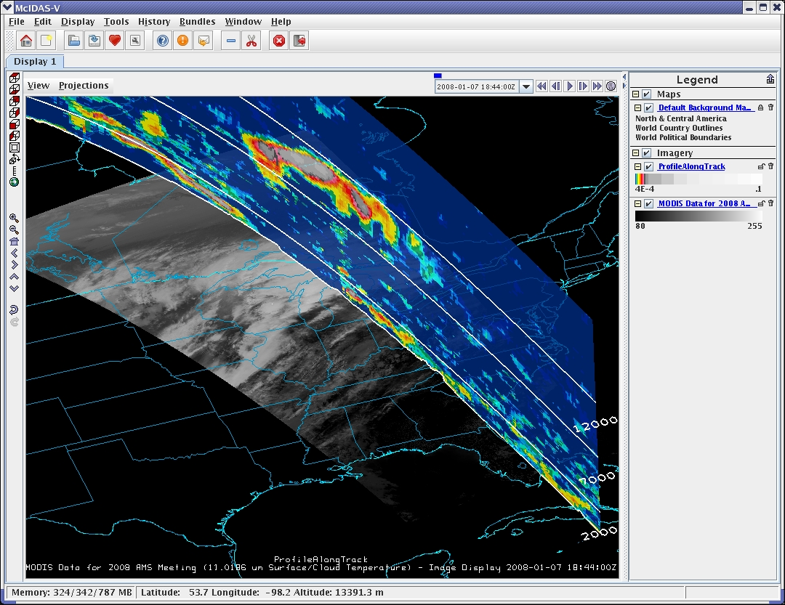

# ISRSE 2009 Web Resource Demonstration Information

Archived from the ESIP wiki page <a href="https://wiki.esipfed.org/ISRSE_2009_Web_Resource_Demonstration_Information">ISRSE 2009 Web Resource Demonstration Information</a>.

Please provide information about web resources that you would like to be
included in our demonstration at the 2009 ISRSE meeting in Stresa.
Please provide all information by **March 20, 2009** to allow us enough
time to integrate the resource links and information into the virtual
machine that will be developed and distributed as part of the
demonstration.

Please include the following information for each service you want to
provide:

- A short name for the site/resource
- A narrative description of the site/resource that describes:
  - The purpose of the site/resource
  - The information available through the site/resource
  - Any other related information about the site/resource
- The organization hosting the site/resource (as it should be listed
  with the site/resource links in the VM)
- Contact name and information for more information about the
  site/resource
- Screenshots (optional)

------------------------------------------------------------------------

**Satellite Observations in Science Education**
[SOSE](http://www.ssec.wisc.edu/sose)

The purpose of this site is to improve the teaching and learning of the
Earth system through quality educational resources that make use of
satellite observations. Recognizing the increasing importance of online
learning techniques, this site makes freely available a library of
Reusable Content Objects (RCOs) - a toolkit adaptable to a wide variety
of applications. Using this toolkit, an educator can quickly assemble
highly interactive web-based activities.

The site also provides access to real-time satellite data via a very
simple (one click) interface.

Sponsored by [NASA](http://www.nasa.gov), developed and hosted by the
University of Wisconsin Space Science and Engineering Center,
[SSEC](http://www.ssec.wisc.edu) Contact information available on the
site.

------------------------------------------------------------------------

**McIDAS-V** [McIDAS-V](http://www.ssec.wisc.edu/mcidas/software/v/)

McIDAS-V is a **free**, open source, visualization and data analysis
software package that is the next generation in SSEC's 35-year history
of sophisticated McIDAS software packages. McIDAS-V displays weather
satellite (including hyperspectral) and other geophysical data in 2- and
3-dimensions. McIDAS-V can also analyze and manipulate the data with its
powerful mathematical functions.

Developed by the University of Wisconsin Space Science and Engineering
Center, [SSEC](http://www.ssec.wisc.edu)

Screenshot follows:

<figure>

<figcaption>McV_screenshot.jpg</figcaption>
</figure>
